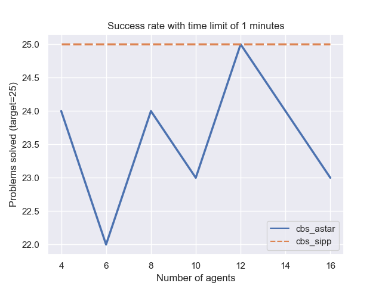
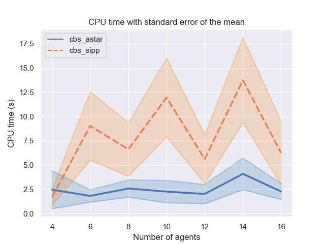

# CMPT 417 Project
# Group members: 
> William Horvath, Trung Hieu Le, Leon Lee

## Introduction:
We propose for our group project to implement and test the Safe Interval Path Planning (SIPP) search algorithm in Python, in the context of the multi-agent path finding (MAPF) algorithms Cooperative A* and Conflict-Based Search (CBS). We aim to combine, refine, and extend our individual projects on MAPF by modularizing the single-agent planner component to work with both A* (original) and SIPP (our new implementation) algorithms. After implementing SIPP, we would like to test/benchmark the resultant program under the four combinations of (A*, SIPP) x (Coop-A*, CBS) on a battery of test instances, which would include instances given in the individual assignment and instances that we have crafted.
We hope to answer questions about which combination of planner and multi-agent path finder gives the fastest result in different classes of instances (and if there even are significant differences between the classes’ results), and also to compare the amount of nodes expanded and memory used by each one. Some of these instance classes which we can use to categorize results are # of agents, crowded vs sparse, and/or number of obstacles in the map. We would also like to discover whether suboptimal solutions occur with A* and not SIPP, and vice versa. 

## Reproducing our results:
Requires Python 3.10+

Install the prerequisites (won't work wihtout them!):
```bash
pip install -r requirements.txt
```

### 1 - Manually running the MAPF with CBS using A* as low-level search
You can run the program like so:
```bash
python run_experiments.py --instance instances/test4.txt --solver CBS --lowlevel Astar
```
(you can also replace the instance with one of your choosing)

### 2 - Manually running the MAPF with CBS using SIPP as low-level search
You can run the program like so:
```bash
python run_experiments.py --instance instances/test4.txt --solver CBS --lowlevel SIPP
```
(you can also replace the instance with one of your choosing)

### 3 - Benchmarking random maps for CPU time stats
The benchmark is based on random maps generated at runtime which CBS using both lowlevel searches are confirmed to be able to solve within 30 seconds. For each number of agents 4,6,...,14,16, the benchmark utility generates 25 maps of a 10x10 size, with random obstacles (5% chance to be occupied) and random start/goal positions. Then, it tests CBS + both lowlevel searches to see how long they take and how many nodes they expand (under 40 seconds).

You can execute the benchmark with the following command (it may take a long time):
```bash
python run_experiments.py --benchmark random
```
After it finishes executing, you can view the results with the plot_benchmark program:
```bash
python plot_benchmark.py --plot random
```
Possible outputs can be as seen below:
<p align="center">
    
    
</p>

### 4 - Benchmarking random maps for success rate stats
For each number of agents 4,6,...,14,16, the benchmark utility generates one map of a 10x10 size, with the position of the obstacles (5% of the map) and start/goal positions being randomized for 25 trials, and tests both lowlevel searches to see whether they are able to solve the scenario or not under 60 seconds.

You can execute the benchmark with the following command (it may take a long time):
```bash
python run_experiments.py --benchmark success
```
After it finishes executing, you can view the results with the plot_benchmark program:
```bash
python plot_benchmark.py --plot success
```
Possible outputs can be as seen below:
<p align="center">
    
    
</p>